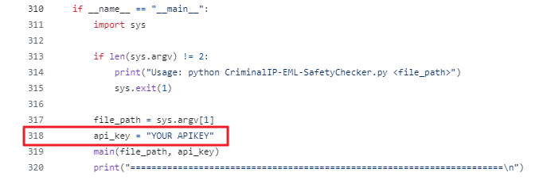
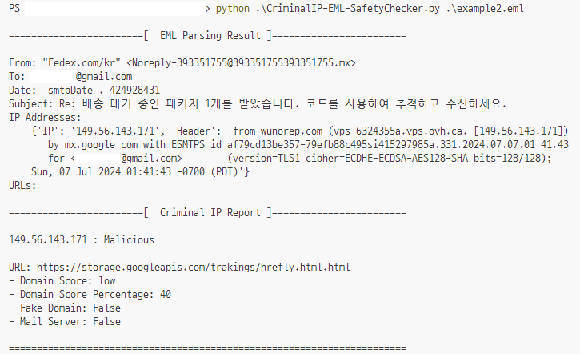

# CriminalIP-EML-SafetyChecker


## Introduction

This project utilizes EML files (email files) to detect attacks using email spoofing techniques. Attackers can disguise the sender using email headers to make emails appear legitimate. By extracting IP addresses from the EML header and URLs from the EML body, this project detects malicious content by querying [CriminalIP](https://www.criminalip.io) for their threat status.

## Prerequisites

- [CriminalIP.io](https://www.criminalip.io) API Key
 
## Installation
 
To install the project, follow these steps:
 
```bash
$ git clone https://github.com/user_name/<CriminalIP-EML-SafetyChecker>.git
$ cd <CriminalIP-EML-SafetyChecker>
<CriminalIP-EML-SafetyChecker>$ pip install requests
<CriminalIP-EML-SafetyChecker>$ pip install BeautifulSoup4
```
## Add API Key
 
<br/>
Make sure to input your Criminal IP API key in the appropriate location within the code.
 
## Examples
 
To run the project, use the following command:
 
```bash
<CriminalIP-EML-SafetyChecker>$ python3 CriminalIP-EML-SafetyChecker.py <file_path>
```
 

 
## Errors and Explanations
- Not Domain: The format does not match a valid domain.
- Usage: python CriminalIP-EML-SafetyChecker.py <file_path>: The usage format is incorrect (file path not entered).
- Invalid API key format: The API key is not entered or the format is incorrect.
 
## Usage
Ensure your script is executed with the correct file path:
```bash
python CriminalIP-EML-SafetyChecker.py <file_path>
```
